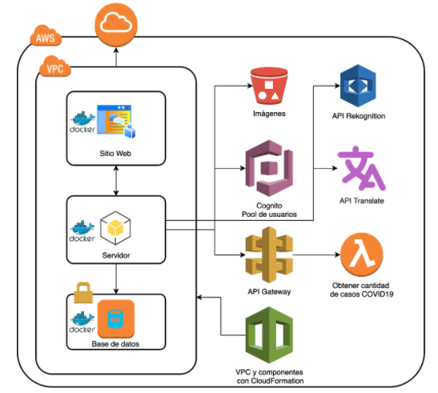

# uSocial

## Levantar los servicios usando docker-compose

Ubicarse en la ruta donde está el archivo *docker-compose.yml* y ejecutar:

`docker-compose up -d`

Donde:

-d, --detach: Corre los servicios en segundo plano

Para detener los servicios ejecutar:

`docker-compose down`

Para más comandos, ejecutar `docker-compose -h` para ver los parametros y comandos disponibles.

## Levantar los sevicios sin docker-compose

## Servidor

### Construir imagen de docker

Ubicarse en la ruta donde está el *Dockerfile* y ejecutar:

`docker build -t usocial-back .`

Donde:

-t, --tag: Es el tag o nombre que tendrá la imagen

### Correr servidor

`docker run --env-file=.env -p 5000:5000 usocial-back`

Donde:

**.env** contiene las variables de entorno

```
JWT_SECRET=<secret>
PORT=<port>
COGNITO_CLIENT_ID=<id>
MONGO_URI=<uri>
CLIENT_URL=<client_url>
```
También pueden especificarse cada una en el comando de docker run utilizando el flag `-e`. Ejemplo: `-e MONGO_URI=uri`

## Cliente

### Construir imagen de docker

Ubicarse en la ruta donde está el *Dockerfile* y ejecutar:

`docker build -t usocial-front .`

Donde:

-t, --tag: Es el tag o nombre que tendrá la imagen

### Correr pagina web
`docker run -p 80:80 usocial-front`

# Arquitectura AWS



# Virtual Private Cloud

En la carpeta `aws` se encuentra el archivo de cloud-formation para crear una VPC con una subred privada y una pública.

En la subred pública se aloja el cliente y el servidor

En la subred privada se aloja la base de datos para que no pueda ser accedida desde internet.

# Security Groups

El security group de la base de datos tiene habilitado los puertos `27017-27019`

El security group del cliente y servidor tiene habilitado los puertos `80, 4000` donde corre el cliente y el servidor respectivamente.

# IAM

Se utilizaron 2 usuarios IAM

- administrador_201709054
- brayan_chinchilla

# Credenciales de AWS

Para que aws-cli que el backend utiliza para conectarse a los servicios de AWS funcione, se debe crear un archivo llamado `credentials` en `~/.aws/credentials` que contenga lo siguiente

```
[default]
aws_access_key_id = <access_key>
aws_secret_access_key = <secret_access_key>
```